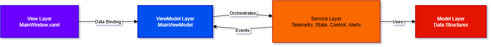
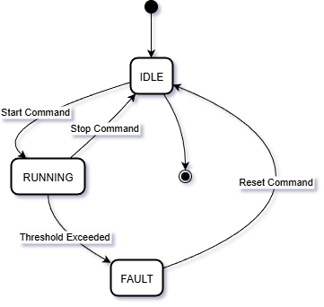

# Control Station UI Simulator

A professional Windows desktop application simulating an industrial control station with real-time telemetry monitoring, state management, and alert systems.

<div align="center">


</div>

---

## Features

- Real-time telemetry simulation (Temperature, Pressure, Power Output)
- State machine with validated transitions (IDLE → RUNNING → FAULT)
- Severity-based alert system (INFO, WARNING, CRITICAL)
- Configurable threshold monitoring
- MVVM architecture with dependency injection
- Modern dark theme UI

---

## Architecture
<div align="center">

</div>
---

## State Machine
<div align="center">

</div>

## Installation

### Prerequisites
- **Visual Studio 2022** (with .NET desktop development workload)
- **.NET 8.0 SDK** - [Download](https://dotnet.microsoft.com/download/dotnet/8.0)

### Build & Run

**Option 1: Visual Studio**
```bash
# Open solution
ControlStationSimulator.sln

# Press F5 to build and run
```

**Option 2: Command Line**
```bash
# Restore dependencies
dotnet restore

# Build project
dotnet build

# Run application
dotnet run --project ControlStationSimulator/ControlStationSimulator.csproj
```

---

## Usage

1. **Start System** - Click "START SYSTEM" button
   - State changes to RUNNING (green indicator)
   - Telemetry updates every 1 second

2. **Configure Thresholds**
   - Enter Max Temperature (°C) and Max Pressure (bar)
   - Click "APPLY CONFIGURATION"

3. **Trigger Fault**
   - Set threshold below current telemetry value
   - System automatically enters FAULT state (red indicator)

4. **Reset System**
   - Click "RESET FAULT" to return to IDLE

---

## Implementation Details

### Telemetry Simulation
- Deterministic sine/cosine wave patterns
- 1-second update interval
- Bounded values for stability

### MVVM Pattern
- Zero business logic in code-behind
- ICommand pattern for UI actions
- ObservableCollection for real-time updates

### Dependency Injection
- Microsoft.Extensions.DependencyInjection
- Services registered as singletons
- Constructor injection throughout

---

## Extension to Real Hardware

Replace simulation service with hardware driver:

```csharp
// Define interface
public interface ITelemetryDataSource
{
    event EventHandler<TelemetryData> TelemetryUpdated;
    void Start();
    void Stop();
}

// Implement for your protocol (OPC-UA, Modbus, S7)
public class HardwareService : ITelemetryDataSource { }

// Register in App.xaml.cs
services.AddSingleton<ITelemetryDataSource, HardwareService>();
```

---

## License

MIT License

---
